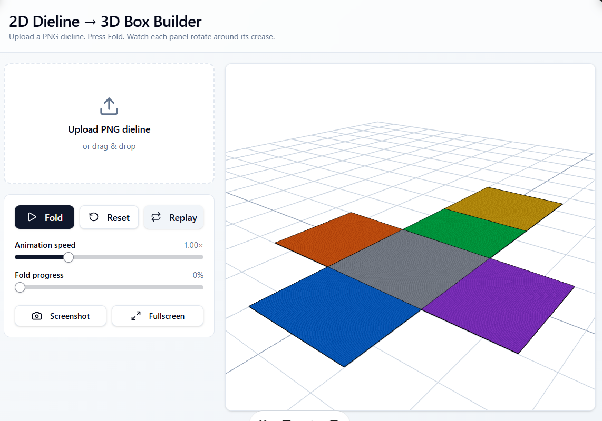
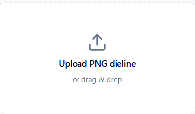
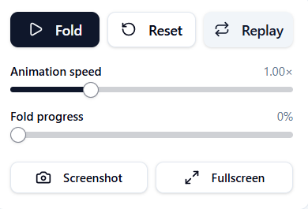
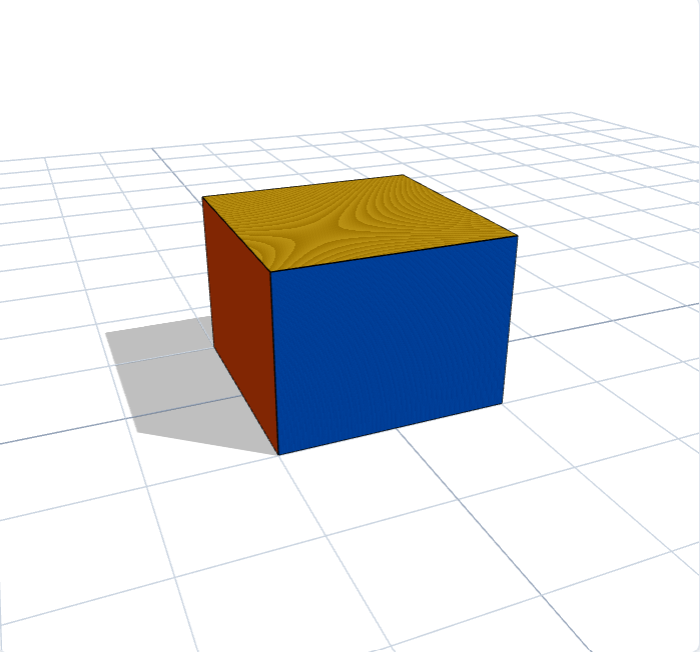

# 📦 2D Dieline to 3D Box Converter

An interactive web application that transforms a flat **2D dieline** into a realistic **3D foldable box** using **React**, **Three.js**, and **React Three Fiber**.

The application provides an intuitive interface for uploading dieline images, visualizing the folding process, controlling animation, and interacting with the generated 3D model in real time.

---

## 🌐 Live Demo

**Live Application**

https://2d-dieline-to-3d-box-converter.vercel.app/

---

## 🚀 Features

- 📤 Upload PNG/JPG dieline images
- 🖼️ Real-time 2D preview
- 📦 Interactive 3D box generation
- 🎬 Smooth folding animation
- ▶️ Fold, Reset and Replay controls
- ⚡ Adjustable animation speed
- 📈 Interactive fold progress slider
- 🖱️ Orbit camera controls
- 📸 Screenshot capture
- 🖥️ Fullscreen mode
- 📱 Responsive layout

---


# 📸 Application Preview

<table>
<tr>
<td align="center">
<b>Home Page</b><br>

</td>

<td align="center">
<b>Upload Panel</b><br>

</td>
</tr>

<tr>
<td align="center">
<b>Animation Controls</b><br>

</td>

<td align="center">
<b>Fully Folded 3D Box</b><br>

</td>
</tr>
</table>

---

# 🛠️ Technology Stack

### Frontend

- React 19
- TypeScript
- Vite

### 3D Graphics

- Three.js
- React Three Fiber
- Drei

### State Management

- Zustand

### UI

- Tailwind CSS
- shadcn/ui
- Lucide React

---

# ⚙️ Installation

Clone the repository

```bash
git clone https://github.com/Akshaykumar1222/2D-Dieline-to-3D-Box-Converter.git
```

Navigate into the project

```bash
cd 2D-Dieline-to-3D-Box-Converter
```

Install dependencies

```bash
npm install
```

Run the development server

```bash
npm run dev
```

---

# 📂 Project Structure

```
src/
│
├── components/
│   ├── UploadPanel
│   ├── ThreeScene
│   ├── BoxBuilder
│   ├── Controls
│   └── AnimationController
│
├── hooks/
│
├── utils/
│
├── routes/
│
├── App.tsx
└── main.tsx
```

---

# ⚡ How It Works

1. Upload a dieline image.
2. The image is prepared for visualization.
3. Individual box faces are generated in a Three.js scene.
4. Each face rotates around predefined hinge points.
5. Fold progress is animated smoothly using easing functions.
6. Users can rotate, zoom, replay, and capture the final folded box.

---

# ✨ Key Highlights

- Real-time 3D rendering
- Hinge-based folding animation
- Interactive camera controls
- Responsive interface
- Adjustable animation controls
- Screenshot export
- Fullscreen visualization
- Modern React architecture

---

# 🔮 Future Enhancements

- Automatic dieline detection
- Support for multiple box templates
- Texture mapping for individual faces
- Export as GLTF/OBJ
- Physics-based folding simulation
- Custom box dimension support

---

# 👨‍💻 Developer

**Akshay Kumar**

GitHub

https://github.com/Akshaykumar1222

---

# 📄 License

This project is created for educational, portfolio, and demonstration purposes.
